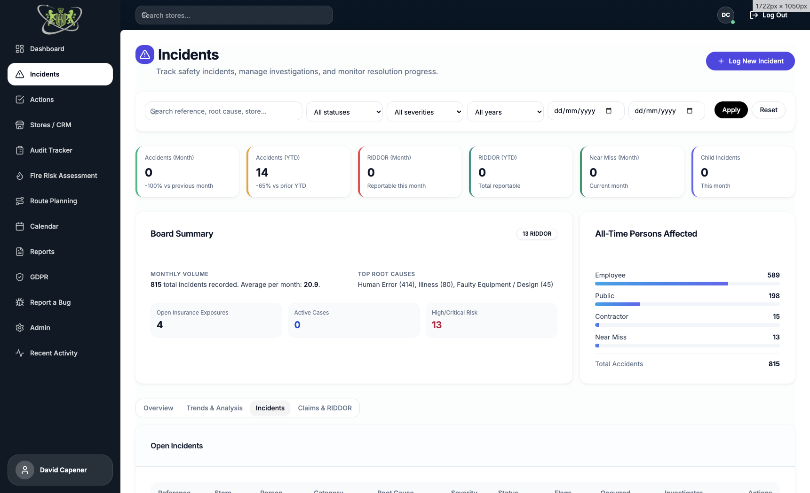
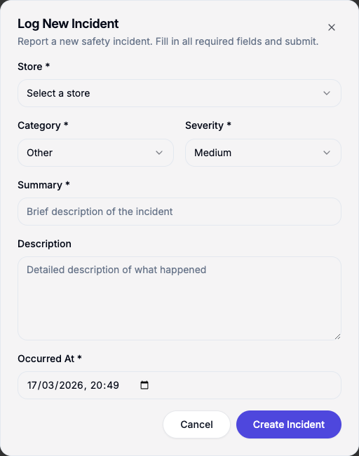
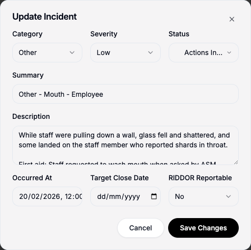
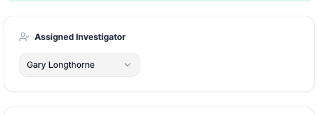
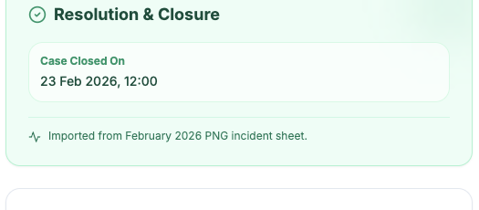
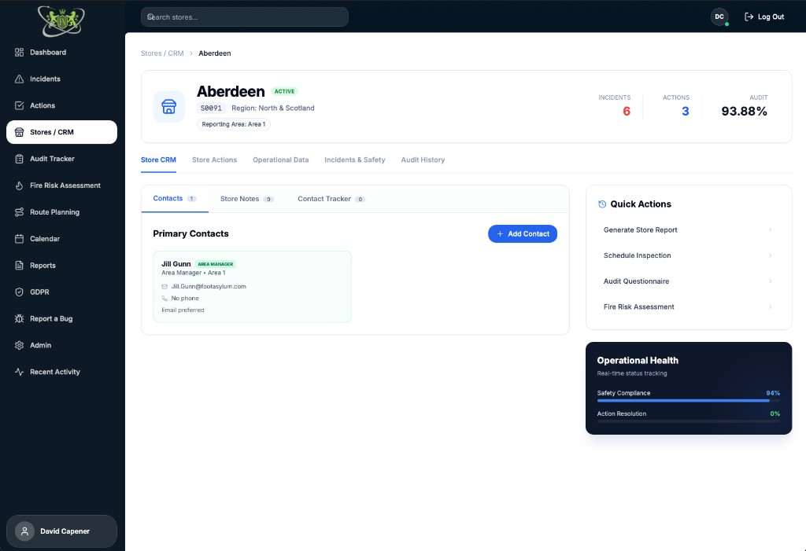
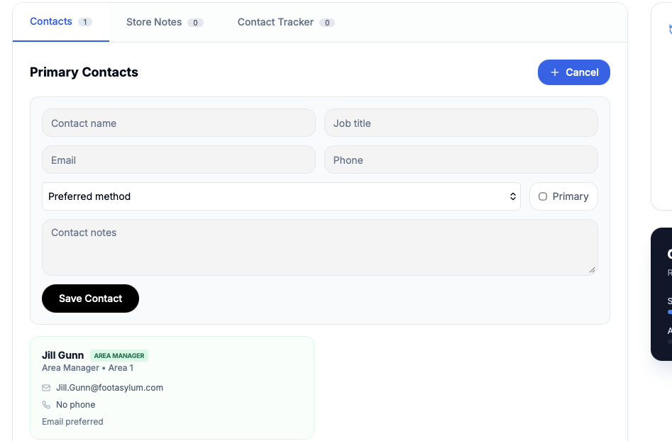
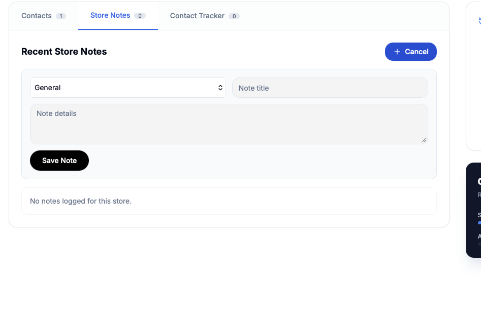
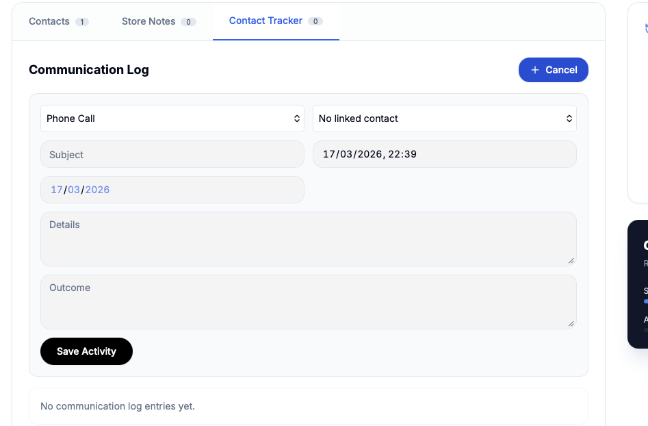

# KSS Admin Guide: Incidents and Store / CRM

## Purpose
This guide is for **KSS Admin users** and explains:
1. How to add and manage incidents (new incident, update, assign investigator, close).
2. How to use the Store / CRM pages to save notes about a store and add contacts.

---

## 1) Before You Start
- Make sure you are logged into Footasylum.kssnwltd.co.uk.
- Open **Incidents** from the main navigation.
- You should be able to see:
  - The incidents list/table.
  - Search and filter options.
  - A **New Incident** button.

If you cannot see the Incidents page or button, contact Dave to confirm your access level.

### Incidents Page Example

---

## 2) Add a New Incident (Step-by-Step)

1. Go to **Incidents**.
2. Click **New Incident**.
3. Complete the form:
   - **Store***: Select the affected store.
   - **Category***: Choose the incident type (e.g. Accident, Near Miss, Security, Fire, Health & Safety, Other).
   - **Severity***: Low / Medium / High / Critical.
   - **Summary***: Short, clear incident headline.
   - **Description**: Full narrative of what happened.
   - **Occurred At***: Date and time of the event.
4. Click **Create Incident**.
5. The system opens the incident detail page automatically.

### Add New Incident Example

### Tips for Better Incident Quality
- Keep the summary factual and short.
- Put detail in the description (who, what, where, when, immediate actions).
- Check date/time carefully before submitting.

---

## 3) Update an Existing Incident (Step-by-Step)

1. Open **Incidents**.
2. Locate the incident (use search/filters if needed).
3. Click the incident row/card to open it.
4. On the incident detail page, click **Edit Incident**.
5. Update fields as needed:
   - **Category**
   - **Severity**
   - **Status** (Open / Under Investigation / Actions In Progress)
   - **Summary**
   - **Description**
   - **Occurred At**
   - **Target Close Date**
   - **RIDDOR Reportable** (Yes/No)
6. Click **Save Changes**.

### Update Incident Example

### Important Notes
- Keep status aligned with the real case stage.
- Use **Under Investigation** when review is active.
- Use **Actions In Progress** when corrective actions are underway.

---

## 4) Assign an Investigator (Recommended Workflow)

1. Open the incident detail page.
2. In the investigation area, assign an investigator.
3. Save/confirm assignment.

### Investigator Example

Tip: assigning an investigator helps ownership and follow-up.

---

## 5) Close an Incident

1. Open the incident detail page.
2. Confirm all required actions/investigation outcomes are completed.
3. Click **Close Incident** and confirm.

### Closure Example

Once closed, the incident is moved to the closed incidents area and is treated as historical.

---

## Store / CRM: Notes and Contacts

Admins can use the **Stores** area to keep notes about each store and maintain a list of contacts. This section explains how to open a store’s CRM and how to add contacts and store notes.

---

### 1) Before You Start (Store / CRM)

- Make sure you are logged into Footasylum.kssnwltd.co.uk.
- Open **Stores** (or **Stores / CRM**) from the main navigation.
- You should see the stores list. Use search or filters to find a store, then click the store to open its detail page.
- On the store detail page, you will see tabs: **Contacts**, **Store Notes**, and **Contact Tracker**.

If you cannot see the Stores page or the CRM tabs, contact Dave to confirm your access level.

### Store Detail Page Example

---

### 2) Add a Contact (Step-by-Step)

1. Go to **Stores** and open the store you want.
2. Make sure the **Contacts** tab is selected.
3. Click **Add Contact**.
4. Complete the form:
   - **Contact name***: Full name of the contact.
   - **Job title**: Role or title (e.g. Store Manager, Assistant Manager).
   - **Email**: Email address.
   - **Phone**: Phone number.
   - **Preferred method**: Phone / Email / Either (optional).
   - **Primary**: Tick if this is the main contact for the store (optional).
   - **Contact notes**: Any extra details (optional).
5. Click **Save Contact**.
6. The contact appears in the list for that store.

### Add Contact Example

### Tips for Contacts
- Use **Primary** for the main store contact so it’s easy to spot.
- Add job title and preferred method to make follow-ups easier.

---

### 3) Add a Store Note (Step-by-Step)

1. Go to **Stores** and open the store.
2. Click the **Store Notes** tab.
3. Click **New Note**.
4. Complete the form:
   - **Note type**: General / Contact / Audit / FRA / Other.
   - **Note title**: Short title (optional).
   - **Note details***: The main note content (required).
5. Click **Save** (or the equivalent submit button).
6. The note appears in the list with the date and your name.

### Add Store Note Example

### Tips for Store Notes
- Use **Note type** to keep notes organised (e.g. Audit for audit follow-ups, FRA for fire risk notes).
- Keep titles short and put the detail in the note body.

---

### 4) Contact Tracker

The **Contact Tracker** tab lets you log calls, emails, and other interactions with contacts (e.g. phone call, email, audit follow-up). You can record the subject, details, outcome, and follow-up date. Use it when you need a simple log of contact history for the store.

### Contact Tracker Example

